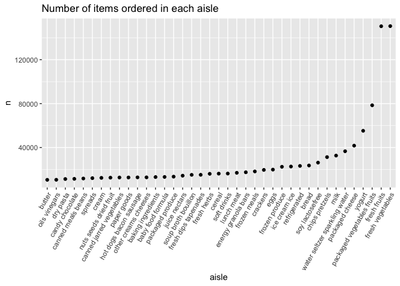

Homework 3
================
Vasuda Kapoor
2022-10-13

Library calls

``` r
library(tidyverse)
```

    ## ── Attaching packages ─────────────────────────────────────── tidyverse 1.3.2 ──
    ## ✔ ggplot2 3.3.6      ✔ purrr   0.3.5 
    ## ✔ tibble  3.1.8      ✔ dplyr   1.0.10
    ## ✔ tidyr   1.2.1      ✔ stringr 1.4.1 
    ## ✔ readr   2.1.3      ✔ forcats 0.5.2 
    ## ── Conflicts ────────────────────────────────────────── tidyverse_conflicts() ──
    ## ✖ dplyr::filter() masks stats::filter()
    ## ✖ dplyr::lag()    masks stats::lag()

``` r
library(ggridges)
library(patchwork)
library(devtools)
```

    ## Loading required package: usethis

``` r
library(hexbin)
```

# Problem 1

How many aisles are there, and which aisles are the most items ordered
from?

``` r
#devtools::install_github("p8105/p8105.datasets", force = TRUE, INSTALL_opts = c('--no-lock'))
library(p8105.datasets)
data("instacart")
instacart_df = instacart %>%
  janitor::clean_names()

n_aisle = instacart_df %>%
  summarise(
    aisle_dist = n_distinct(aisle))
aisle_order = instacart_df %>%
  group_by(aisle_id) %>%
  distinct(order_id) %>%
  count() %>%
  arrange(desc(n))
```

There are 134 aisles. Aisle 24 has the most number of orders.

Make a plot that shows the number of items ordered in each aisle,
limiting this to aisles with more than 10000 items ordered. Arrange
aisles sensibly, and organize your plot so others can read it.

``` r
instacart_df %>% 
  count(aisle) %>% 
  filter(n > 10000) %>% 
  mutate(aisle = fct_reorder(aisle, n)) %>% 
  ggplot(aes(x = aisle, y = n)) + 
  geom_point() + 
  labs(title = "Number of items ordered in each aisle") +
  theme(axis.text.x = element_text(angle = 60, hjust = 1))
```

<!-- -->
Make a table showing the three most popular items in each of the aisles
“baking ingredients”, “dog food care”, and “packaged vegetables fruits”.
Include the number of times each item is ordered in your table.

``` r
instacart_df %>%
  filter(aisle == "baking ingredients" | aisle == "dog food care" | aisle == "packaged vegetables fruits") %>%
  group_by(aisle) %>%
  count(product_name) %>%
  mutate(rank = min_rank(desc(n))) %>% 
  filter(rank < 4) %>% 
  arrange(desc(n)) %>%
  knitr::kable()
```

| aisle                      | product_name                                  |    n | rank |
|:---------------------------|:----------------------------------------------|-----:|-----:|
| packaged vegetables fruits | Organic Baby Spinach                          | 9784 |    1 |
| packaged vegetables fruits | Organic Raspberries                           | 5546 |    2 |
| packaged vegetables fruits | Organic Blueberries                           | 4966 |    3 |
| baking ingredients         | Light Brown Sugar                             |  499 |    1 |
| baking ingredients         | Pure Baking Soda                              |  387 |    2 |
| baking ingredients         | Cane Sugar                                    |  336 |    3 |
| dog food care              | Snack Sticks Chicken & Rice Recipe Dog Treats |   30 |    1 |
| dog food care              | Organix Chicken & Brown Rice Recipe           |   28 |    2 |
| dog food care              | Small Dog Biscuits                            |   26 |    3 |

Make a table showing the mean hour of the day at which Pink Lady Apples
and Coffee Ice Cream are ordered on each day of the week; format this
table for human readers (i.e. produce a 2 x 7 table)

``` r
instacart_df %>%
  filter(product_name %in% c("Pink Lady Apples", "Coffee Ice Cream")) %>%
  select(product_name, order_dow, order_hour_of_day) %>%
  group_by(product_name, order_dow) %>%
  summarise(mean_hour = mean(order_hour_of_day)) %>%
  spread(key = order_dow, value = mean_hour) %>%
  knitr::kable(digits = 2)
```

    ## `summarise()` has grouped output by 'product_name'. You can override using the
    ## `.groups` argument.

| product_name     |     0 |     1 |     2 |     3 |     4 |     5 |     6 |
|:-----------------|------:|------:|------:|------:|------:|------:|------:|
| Coffee Ice Cream | 13.77 | 14.32 | 15.38 | 15.32 | 15.22 | 12.26 | 13.83 |
| Pink Lady Apples | 13.44 | 11.36 | 11.70 | 14.25 | 11.55 | 12.78 | 11.94 |

# Problem 2

\##Load, tidy, and otherwise wrangle the data. Your final dataset should
include all originally observed variables and values; have useful
variable names; include a weekday vs weekend variable; and encode data
with reasonable variable classes. Describe the resulting dataset
(e.g. what variables exist, how many observations, etc).

``` r
# Load data and clean names
accel_df = read_csv("data/accel_data.csv") %>%
  janitor::clean_names()
```

    ## Rows: 35 Columns: 1443
    ## ── Column specification ────────────────────────────────────────────────────────
    ## Delimiter: ","
    ## chr    (1): day
    ## dbl (1442): week, day_id, activity.1, activity.2, activity.3, activity.4, ac...
    ## 
    ## ℹ Use `spec()` to retrieve the full column specification for this data.
    ## ℹ Specify the column types or set `show_col_types = FALSE` to quiet this message.

``` r
accel_df2 = read_csv("data/accel_data.csv") %>%
  janitor::clean_names()
```

    ## Rows: 35 Columns: 1443
    ## ── Column specification ────────────────────────────────────────────────────────
    ## Delimiter: ","
    ## chr    (1): day
    ## dbl (1442): week, day_id, activity.1, activity.2, activity.3, activity.4, ac...
    ## 
    ## ℹ Use `spec()` to retrieve the full column specification for this data.
    ## ℹ Specify the column types or set `show_col_types = FALSE` to quiet this message.

``` r
# pivot the activity values from wide to long and convert minute column to numerical type
accel_df = 
  pivot_longer(
    accel_df, 
    activity_1:activity_1440,
    names_to = "minute",
    values_to = "activity_value",
    names_prefix = "activity_"
  ) %>% 
  mutate(minute = as.numeric(minute))
  

# Add weekday vs weekend variable
accel_df = accel_df %>%
  mutate(weekend = if_else(day == "Saturday" | day == "Sunday", TRUE, FALSE))
```

This dataset contains five weeks of accelerometer data collected on a 63
year-old male. It dataset has 6 variables and 50400. It contains the
following variables- week number, day_id, day, minute of the day,
activity_value, and weekend. The weekend variable shows whether the day
falls on the weekend or not.

\##Traditional analyses of accelerometer data focus on the total
activity over the day. Using your tidied dataset, aggregate across
minutes to create a total activity variable for each day, and create a
table showing these totals. Are any trends apparent?

``` r
total_activity_tbl = accel_df %>%
  group_by(day, week) %>%
  summarise(total_activity = sum(activity_value)) %>%
  pivot_wider(
    names_from = day,
    values_from = total_activity
  ) %>%
  select(week, Monday, Tuesday, Wednesday, Thursday, Friday, Saturday, Sunday) %>%
  knitr::kable()
```

    ## `summarise()` has grouped output by 'day'. You can override using the `.groups`
    ## argument.

``` r
total_activity_tbl
```

| week |    Monday |  Tuesday | Wednesday | Thursday |   Friday | Saturday | Sunday |
|-----:|----------:|---------:|----------:|---------:|---------:|---------:|-------:|
|    1 |  78828.07 | 307094.2 |    340115 | 355923.6 | 480542.6 |   376254 | 631105 |
|    2 | 295431.00 | 423245.0 |    440962 | 474048.0 | 568839.0 |   607175 | 422018 |
|    3 | 685910.00 | 381507.0 |    468869 | 371230.0 | 467420.0 |   382928 | 467052 |
|    4 | 409450.00 | 319568.0 |    434460 | 340291.0 | 154049.0 |     1440 | 260617 |
|    5 | 389080.00 | 367824.0 |    445366 | 549658.0 | 620860.0 |     1440 | 138421 |

There don’t seem to be any trends here. Although, it is worth noting
that the activity values for week 4 and 5 are much lower on the weekends
compared to weekdays.

\##Accelerometer data allows the inspection activity over the course of
the day. Make a single-panel plot that shows the 24-hour activity time
courses for each day and use color to indicate day of the week. Describe
in words any patterns or conclusions you can make based on this graph.

``` r
# x axis: minute 1 to 1440
activity_plot =
  accel_df %>%
  ggplot(aes(x = minute, y = activity_value, color = day)) +
  geom_line(alpha = .4) +
  geom_smooth(se = FALSE)
activity_plot
```

    ## `geom_smooth()` using method = 'gam' and formula 'y ~ s(x, bs = "cs")'

<!-- --> It
looks like the activity increases gradually over the course of the day,
plateaus around minute 750 and then starts falling down again around
minute 1250. On Sundays, the activity increases disproportionately
around minute 600 and on Fridays, the activity increases
disproportionately around minute 1250.

# Problem 3

\##Describe dataset.

``` r
library(p8105.datasets)
data("ny_noaa") 
```

The ny_noaa dataset has 7 variables and 2595176 observations. This
dataset contains weather data for all stations in the state of New York.
The variables in this dataset include station ID, date, precipitation,
snowfall, snow depth, maximum recorded temperature and minimum recorded
temperature. This dataset contains 3387623 rows with missing values.

\##Do some data cleaning. Create separate variables for year, month, and
day. Ensure observations for temperature, precipitation, and snowfall
are given in reasonable units.

``` r
# data cleaning
ny_noaa_tidy = ny_noaa %>%
  janitor::clean_names() %>%
  separate(date, into = c("year", "month", "day"), sep = "-") %>%
  mutate(tmax = as.numeric(tmax),
         tmin = as.numeric(tmin),
         year = as.numeric(year)) %>%
  mutate(tmax = tmax/10,
         tmin = tmin/10)
```

\##For snowfall, what are the most commonly observed values? Why?

``` r
snwfall_stats <- ny_noaa_tidy %>%
  count(snow) %>%
  mutate(rank = min_rank(desc(n))) %>%
  filter(rank < 3) %>%
  arrange(desc(n))
snwfall_stats
```

    ## # A tibble: 2 × 3
    ##    snow       n  rank
    ##   <int>   <int> <int>
    ## 1     0 2008508     1
    ## 2    NA  381221     2

The most commonly observed values are 0 and missing. This is probably
because (1) It does not snow on a majority of the days during the year
(2) Snowfall data is not collected for a significant number of days
during the year.

\##Make a two-panel plot showing the average max temperature in January
and in July in each station across years. Is there any observable /
interpretable structure? Any outliers?

``` r
avgtmax_df <- ny_noaa_tidy %>%
  group_by(id, year, month) %>%
  filter(month == "01" | month == "07") %>%
  summarise(avg_max_temp = mean(tmax, NA.rm = TRUE)) %>%
  filter(!is.na(avg_max_temp)) %>%
  filter(month == "01" | month == "07") %>%
  mutate(month = case_when(month ==  "01" ~ "January",
      month ==  "07" ~ "July"))
```

    ## `summarise()` has grouped output by 'id', 'year'. You can override using the
    ## `.groups` argument.

``` r
plot_avgtmax <- avgtmax_df %>%
  ggplot(aes(year, avg_max_temp, group = id, color = id)) +
  geom_line(alpha = 0.3) +
  theme(legend.position = "none") +
  facet_grid(. ~ month) +
  xlab("Year") +
  ylab("Average Maximum Temperature (C)")
plot_avgtmax
```

<!-- --> -
The average max temperatures are overall higher for July than for the
month of January.

- The average max temperature seems to follow a cyclical pattern where
  it goes up for a few years and then comes back down. This is true for
  both months.

- There don’t seem to be any true outliers.

\##Make a two-panel plot showing (i) tmax vs tmin for the full dataset
(note that a scatterplot may not be the best option); and (ii) make a
plot showing the distribution of snowfall values greater than 0 and less
than 100 separately by year.

``` r
# (i) Create plot of tmax  (y axis) vs tmin (x axis)
tmax_tmin_plot <- ny_noaa_tidy %>%
  ggplot(aes(tmin, tmax)) +
  geom_hex() 
# (ii) density plot
snwfall_plot <- ny_noaa_tidy %>%
  filter(0 < snow & snow < 100) %>%
  mutate(year = as.factor(year)) %>%
  ggplot(aes(x = snow, y = year)) +
  geom_density_ridges(alpha = .2)
# show plot (i) and (ii) in a two panel plot
tmax_tmin_plot + snwfall_plot
```

    ## Warning: Removed 1136276 rows containing non-finite values (stat_binhex).

    ## Picking joint bandwidth of 3.76

<!-- -->
